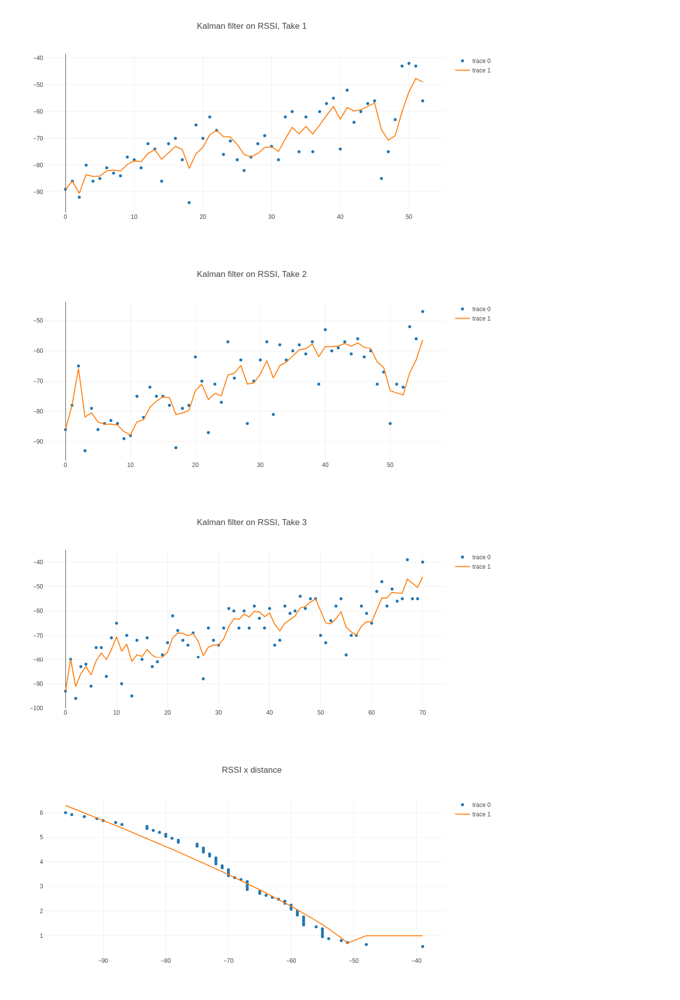

# KalmanFilterExplorative

The aim of this repository is to identify appropriate configurations for the Kalman filter for a bluetooth RSSI-distance application. [pircus/kalman-filter JavaScript library](https://github.com/piercus/kalman-filter) is used. One of the most complete and useful reference I found is [G. A. Terejanu "Extended Kalman Filter Tutorial"](https://cse.sc.edu/~terejanu/files/tutorialEKF.pdf).

The set of configurations yields following plots. Under three plots of Kalman filter, fitted curve of RSSI v.s. distance is also to be seen.

